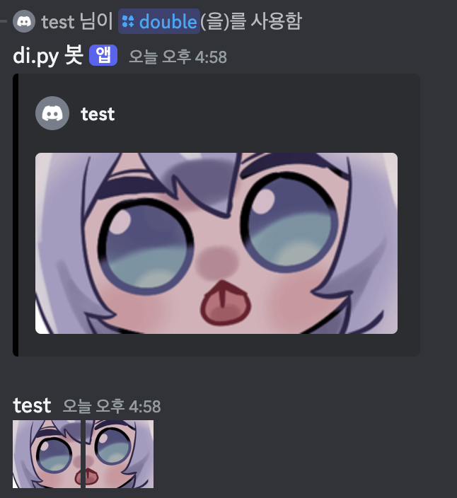
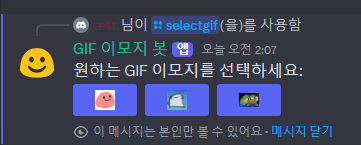

# Discord Emoji Bot

> [!NOTE]
> - [**봇 초대하기**](https://discord.com/oauth2/authorize?client_id=1275860131711815690&permissions=826781527040&integration_type=0&scope=bot)
> - 계속 개발중인 봇이며, 24시간 온라인 여부는 불안정할 수 있습니다.
> - 아직 인증을 받지 못하여 70개의 서버만 가입이 가능합니다.

### 목차

1. [**뭐하는 봇인가요?**](#뭐하는-봇인가요?)
2. [**사용 방법**](#사용-방법)
3. [**개발자들을 위해**](#개발자들을-위해)

<hr>

## 뭐하는 봇인가요?
- 디스코드에서 이모지 경험을 더 풍부하게 해주는 봇입니다.


- 니트로 없이 디스코드에서 GIF 이모지를 보낼 수 있게 해줍니다.


- 두 이모지를 합쳐서 크게 보여주는 기능도 제공합니다.

<br>

## 사용 방법 

**1. 봇을 초대해주세요.**

**2. `/selectgif` 명령어를 입력해주세요.**



**3. 버튼을 눌러 GIF 이모지를 보내세요!**


<br>

## 개발자들을 위해

```
📦discord-emoji-bot
 ┣ 📂commands
 ┃ ┣ 📜default.py
 ┃ ┣ 📜double.py
 ┃ ┣ 📜gif.py
 ┃ ┗ 📜select_gif.py
 ┣ 📜.env.example
 ┣ 📜.gitattributes
 ┣ 📜.gitignore
 ┣ 📜main.py
 ┣ 📜README.md
 ┗ 📜requirements.txt
 ```

> [!NOTE]
> 봇을 직접 호스팅하고 싶은 분들을 위한 설명입니다.

**1. 깃허브 저장소를 클론해주세요.**

**2. `.env` 파일을 만들어주세요.**
`.env` 파일의 안에는 다음과 같은 정보가 필요합니다.
```
TEST_GUILD_ID=원하는 서버 ID
BOT_TOKEN=봇의 토큰
```
- 길드 ID에 입력한 서버에서만 사용가능한 것은 아닙니다.
- 봇이 초대된 서버 모두 사용가능합니다.

**3. 필요한 파이썬 패키지들을 설치해주세요.**
```
pip install -r requirements.txt
```

**4. 봇을 실행해주세요.**
